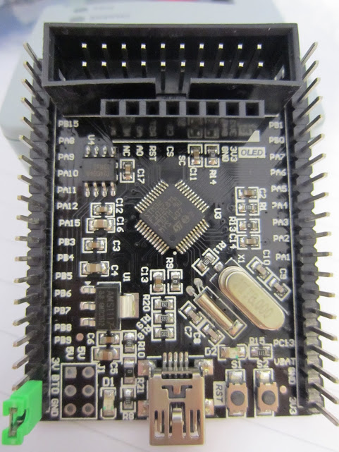
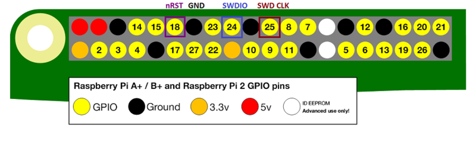
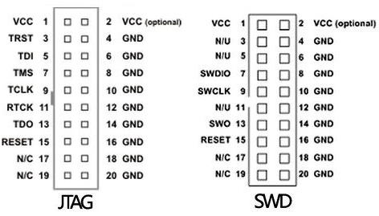

# stm32_smart



## Sources

- [Programming Microcontrollers using OpenOCD...](https://learn.adafruit.com/programming-microcontrollers-using-openocd-on-raspberry-pi/compiling-openocd)
- [STM32 Smart V2.0](http://wiki.stm32duino.com/index.php?title=STM32_Smart_V2.0)
- [STM32 and JTAG via Raspberry](https://log2.ch/2014/stm32-and-jtag-via-raspberry/)

## Flashing the bootloader with Raspberry Pi

### Compiling OpenOCD

```bash
sudo apt-get install git autoconf libtool make pkg-config libusb-1.0-0 libusb-1.0-0-dev
git clone git://git.code.sf.net/p/openocd/code openocd-code
cd openocd-code
./bootstrap
./configure --enable-sysfsgpio --enable-bcm2835gpio
make
sudo make install
```

### Connecting to the Pi

- 3.3V (Pi) to VCC (1)
- GND to GND (4)
- nRST (GPIO18) to RESET (15)
- SWDIO (GPIO24) to SWDIO (7)
- SWDCLK (GPIO25) to SWCLK (9)



[source](https://cdn-learn.adafruit.com/assets/assets/000/031/317/medium800/raspberry_pi_SWDPinoutPi2.png)



[source](http://wiki.stm32duino.com/images/3/36/PotLuck_JTAG_Interface.JPG)


### Flashing the bootloader

```bash
wget https://github.com/rogerclarkmelbourne/STM32duino-bootloader/raw/master/STM32F1/binaries/generic_boot20_pc13.bin
nano openocd.cfg
```

> openocd.cfg

```
source [find interface/raspberrypi-native.cfg]
transport select swd

set CHIPNAME stm32f1x
source [find target/stm32f1x.cfg]

# did not yet manage to make a working setup using srst
#reset_config srst_only
reset_config  srst_only srst_push_pull

adapter_nsrst_delay 100
adapter_nsrst_assert_width 100

bcm2835gpio_swd_nums 25 24
bcm2835gpio_trst_num 7
bcm2835gpio_srst_num 18

init
targets
reset halt
program generic_boot20_pc13.bin 0x8000000 verify
reset
shutdown
```

```bash
sudo openocd
```

## Windows installation

- [Arduino IDE instructions](http://wiki.stm32duino.com/index.php?title=Installation_on_Windows)
- [Driver installation](http://wiki.stm32duino.com/index.php?title=Windows_driver_installation)

## Uploading a sketch

- [Instructions](http://wiki.stm32duino.com/index.php?title=Uploading_a_sketch)
